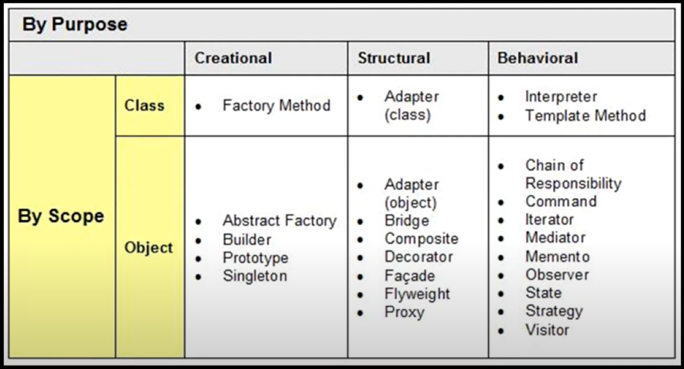
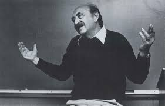

 In the realm of software engineering, design patterns serve as the blueprint of innovation, embodying the fusion of creativity and pragmatism. In the realm of reality however these are simply everywhere from the chair you are sitting on while reading this essay, to the shirts neatly folded in your closet, they intricately weave functionality with elegance, fostering robust and scalable solutions in our digital landscape. 
 

Consider the traffic light down your street: a simple yet effective design conveying even simpler instructions with just three colors. It serves as a testament to the power of thoughtful design. However, not all designs are equal. Just like the poorly constructed parking lot at Hawaiian Brian's it can lead to chaos, so too can poorly implemented design patterns result in fragile and convoluted code.

In my coding projects, I've embraced design patterns as guiding stars, illuminating the path to a good grade and a better understanding. Among these, the Template Method Pattern stands out as a beacon of efficiency and innovation. Much like a master architect drawing upon blueprints of past structures, I've leveraged this pattern to streamline development and promote code reusability. For instance, in my ICS 314 final project, I crafted a generic framework for data processing pipelines, using the meteor template as that professor Moore gave the whole class as a foundation to work on

Furthermore, in managing our profile collections within the API folder, my team and I have implemented the Singleton pattern. The last line of code reads: export const Profiles = new ProfilesCollection();. This declaration signifies the creation of a singleton class, where only one instance of the ProfilesCollection() is instantiated as Profiles. This instance is then imported into other files, enabling universal access and utilization throughout the application.

Additionally, I've employed the Prototype pattern to expedite development while ensuring consistency and reliability across applications. By cloning existing structures and customizing them as needed, I've harnessed the power of this pattern to address novel challenges and achieve higher levels of efficiency in my codebase.

In conclusion, the journey of software development is a testament to the transformative power of design patterns. From the simplicity of a traffic light to the intricacies of digital architecture, they guide us through the complexities of problem-solving. As Oscar-winning filmmaker Saul Bass aptly said, 'Design is thinking made visual,' underscoring the role of design patterns as tangible manifestations of human ingenuity in the ever-evolving landscape of technology.

