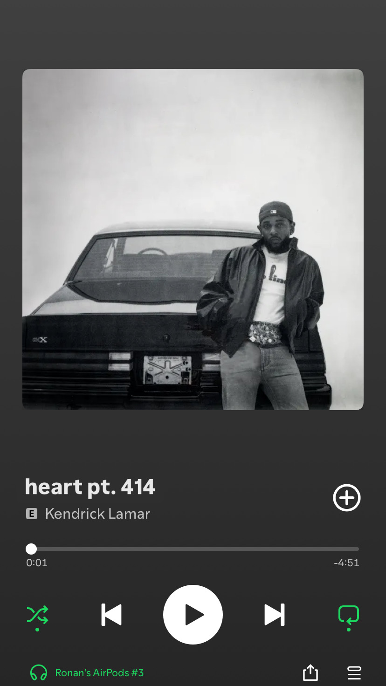

    

<h2>Unexpected</h2> 

    Going into the semester—specifically ICS 414—I was genuinely excited to finally work on a real project alongside like-minded individuals. At the start of the year, I looked forward to collaborating, building something meaningful, and pushing my skills further—and I can confidently say I wasn’t disappointed. I never imagined we’d end up creating an app like the Spire Financial Calculator, but the process taught me more than I expected. From sprint planning to debugging complex features, every step was both challenging and rewarding. Along the way, I met incredibly talented and driven people who not only inspired me to level up my own work but also encouraged me to keep growing outside the classroom. Thanks to this course and the experience it gave me, I landed my first programming-related internship—which honestly felt like a major turning point.

    I learned a lot from this experience, both technically and personally. Early on, I specifically asked to be placed on the backend team because I knew it was an area where I needed to grow. I wanted to challenge myself and step out of my comfort zone. And while I’ll admit I was definitely carried at times by the more experienced members of the backend team, it was still an incredibly valuable experience. Watching how they approached problems, structured code, and collaborated taught me things I couldn’t have picked up from a textbook or lecture. I walked away with a much stronger understanding of backend development—and a clear path forward on where I want to improve next.

    

<h3>Expectations vs Reality </h3>

    I’ll be honest—I really thought this class was going to be a breeze. At the beginning of the semester, one of my teammates and I were joking that we’d probably be done with everything by spring break. It felt like we had plenty of time and that the project wouldn’t be too intense. But when spring break rolled around, reality hit us—there were still so many unfinished tasks, new issues popping up, and unexpected changes to deal with. That moment was a wake-up call. It showed me just how unpredictable the software development process can be, and how even the best-laid plans can quickly shift. More importantly, it taught me that this kind of uncertainty is normal in the industry. Things won’t always go smoothly, and that’s okay. What matters most is learning to adapt, communicate, and keep moving forward as a team.

<h2>Wrapping it All Up</h2>

    By May, we pulled through. We came out with an app that not only looked great but functioned exactly how we envisioned. On top of that, I walked away with more people I can proudly call friends within the department, a solid project I can showcase on my resume, and another meaningful experience I can confidently talk about in future interviews. ICS 414 wasn’t just a class—it was a real stepping stone, both technically and personally, and I’m genuinely proud of how far we came.

    As Kendrick once said in <em>The Heart Part 6</em>, 
    <strong>“This not no gimmick. This is me.”</strong> 
    And after everything we built this semester, I can say the same.

*Note that I used ChatGPT to improve grammar and spelling in this document*