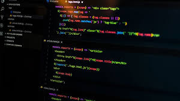

    

<h2>Unexpected</h2> 

 Going into the semester—specifically ICS 414—I was genuinely excited to finally work on a real project alongside like-minded individuals. At the start of the year, I was looking forward to collaborating, building something meaningful, and pushing my skills further, and I can confidently say I wasn’t disappointed at all. I never imagined we’d end up creating an app like the Spire Financial Calculator, but the process taught me more than I expected. From sprint planning to debugging complex features, every step was both challenging and rewarding. Along the way, I got to meet incredibly talented and driven people who not only inspired me to level up my own work but also encouraged me to keep growing outside the classroom. Thanks to this course and the experience it gave me, I was able to land my first programming-related internship—which honestly felt like a major turning point for me.

I learned a lot from this experience, I purposely asked the team to put me in the backend team because my backend development needed work. Even though i was severely carried by the other backend team, it was still a great experience

    

<h3>Ethics </h3>

One thing I learned and one of the most important from all this coursework was Ethics in the industry, how it relates to my ethics for myself, and how navigating the ethical landscape of software engineering is as crucial as mastering its technical intricacies. Delving into discussions surrounding privacy, data security, and the responsible use of technology, I discovered that the decisions we make as software engineers extend far beyond the lines of code we write. They ripple through society, shaping perceptions, influencing behaviors, and sometimes even challenging our own moral compass. As I grappled with ethical dilemmas posed in case studies and real-world examples, I found myself confronting not only the ethical standards of the industry but also my own personal values and convictions. This introspective journey urged me to consider not just what I could create, but the impact of my creations on the world around me. It underscored the importance of integrity, empathy, and a steadfast commitment to ethical practice in every facet of my career as a software engineer.

<h3>Agile Project Management</h3>

Additionally, as I typed away and brainstormed ideas for our final project with my group, I found myself immersed in the concept of Agile project management. Initially, I perceived it as simply everyone working on the main code, but it turned out to be far more nuanced. A fellow colleague stepped in to illustrate that there are distinct branches for each individual. Once these branches are refined, they are merged into the main codebase, a process we repeated. Through our collaborative endeavors, I witnessed firsthand the power of iterative development, adaptability inherent in Agile methodologies. The rigid timelines of our coursework melted away, replaced by a dynamic workflow that embraced change and fostered continuous improvement. Stand-up meetings, sprint planning sessions, and the iterative feedback loop became not just procedural rituals but pillars of our project's success.

Yet, beyond the confines of web application development, the principles of Agile project management resonate profoundly in diverse contexts. Whether crafting software solutions, launching entrepreneurial ventures, or even organizing community events, the ethos of Agile empowers teams to navigate uncertainty, respond to evolving requirements, and deliver value iteratively. It's a philosophy that transcends the boundaries of code, instilling in me a mindset of adaptability, collaboration, and relentless pursuit of excellence in every endeavor I undertake. 

<h2>Wrapping it All Up</h2>

In conclusion, my journey through software engineering education has been transformative, revealing the interconnectedness of technical expertise, ethical considerations, and agile project management principles. From mastering code to navigating ethical dilemmas and embracing Agile methodologies, each aspect has shaped my understanding of the profession. As I step forward, I carry with me a commitment to ethical integrity, adaptability, and collaboration, ready to embark on the next chapter with confidence and a steadfast dedication to excellence, knowing that in the dynamic landscape of technology, every decision carries the potential to shape a better, more equitable future.

*Note that I used ChatGPT to improve grammar and spelling in this document*