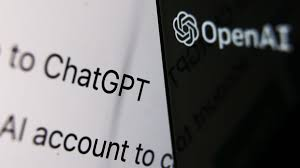

### I. Introduction
AI in education, to me, is like that overfriendly TA in class who answers all your questions with no hesitation. The beauty of AI lies in its accessibility; it's like having that TA available whenever and wherever you have an internet connection. In software engineering, the role of AI can be perceived as both a blessing and a curse. It all depends on how you approach it. Some people will hit cmd+c and cmd+v a few times and call it a day, while others will put in the time and effort to understand. Like the quote goes, 'Give a man a fish, and he eats for a day; teach a man to fish, and he eats for a lifetime.' In the realm of software engineering, those who invest in understanding the underlying principles not only solve the immediate problem but also equip themselves with valuable skills for the future. Personally, I've primarily utilized ChatGPT among various AI options, leveraging its capabilities to enhance my understanding and problem-solving in both general AI usage and specifically in ICS 314

### II. Personal Experience with AI:
I have used AI in class this semester in the following areas:

1. Experience WODs e.g. E18\
   Some experience WODs were pretty straightforward and had instructions to get the job done. However, when instructions were lacking, such as when there was no instructional video, Google and ChatGPT were my saving grace. These WODs, like the practice ones, were designed to help us prepare for the actual in-class WODs. That's why, whether I used GPT or not, I still analyzed how I arrived at the answer afterward and repeated the process, just as the professor encouraged us to do.

2. In-class Practice WODs\
   I refrained from using ChatGPT for these WODs because their primary purpose was to prepare us for the graded in-class WODs, unlike the ungraded ones we did during class. Instead, I typically collaborated with my partner to brainstorm approaches to the problem. Additionally, the professor often provided solutions afterward.

3. In-class WODs \
   I wrestled with a sense of guilt when turning to ChatGPT for assistance with my WODs. However, I found myself at a crossroads: either risk failing the WODs and then studying the answers afterward, or utilize AI to pass the WODs while still ensuring I understood the answers and their rationale. Either way, I was going to understand the answer, so I chose the option that was going to benefit me more in the future. As time went by, however, the guilt that built inside me for using ChatGPT for the previous WODs turned into countless hours studying the previous Experience WODs for the future WODs, and by the end of the semester, I really challenged myself not to use AI at all.

4. Essays\
I've always struggled with making my thoughts sound more professional, in a sense. I can go on for hours on end about the topics that the professor has given us within the essays this semester, but the execution was lacking. ChatGPT helped me out with it. I usually just typed my thoughts down on a Google Doc, and even though it didn't sound horrible, I thought it could sound and flow better. So, I would copy-paste my initial thoughts into ChatGPT and ask AI, 'Could you make this flow better or sound more professional?' I wouldn't just go on ChatGPT and copy-paste the question given to us by the professor and ask it to make me an essay.

5. Final project\
   I was in a rush for some things due to personal issues and needed to use ChatGPT to finish them and not let my teammates down. Just like when I had to create an exercise class for my project, I asked GPT, 'Would I just take one of the existing collections and copy-paste them and change up the variables and such?' Otherwise, I treated the final project like it was an actual site I needed to make for a software engineering job.

6. Learning a concept / tutorial\
   Even though GPT isn't the only thing I turn to when learning a concept or tutorial, it is certainly a factor that comes into play alongside looking in textbooks, YouTube videos, and other sources. I would ask GPT, 'What do you know about ____?' and then proceed to do further research outside of GPT, whether it be on Google, textbooks, YouTube, etc.

7. Answering a question in class or in Discord\
   I didn't ask many questions on Discord since I typically sought assistance from my group when needed. However, during in-class discussions, I freely raised any queries that came to mind, relying on my own judgment without the need for AI assistance to filter them.

8. Asking or answering a smart-question\
   Again, I didn't really ask many questions in Discord, nor did I answer many. However, in other settings like in-class discussions, I actively engaged by asking and answering questions.

9. Coding example e.g. “give an example of using Underscore .pluck”\
   I've never used ChatGPT for that; instead, I probably used the site that the professor provided, which had all the options for Underscore. However, in hindsight, it would have been beneficial to ask ChatGPT, 'Could you give me an example of using Underscore .pluck?'"

10. Explaining code\
    Typically, after I write something down in syntax using only my own thoughts, I develop a solid understanding of it. In such cases, I wouldn't require assistance from ChatGPT to explain it. However, for the purpose of making the explanation more professional or easier to understand for others, I might ask ChatGPT, 'Could you simplify this?' to enhance its clarity.

11. Writing code\
    For most assignments in this class, they are typically variations of past homework or classwork. Consequently, the answers are often found in our previous assignments. When time permits, I prefer to review past assessments to determine what to do. However, when time is limited, I turn to ChatGPT for assistance. Additionally, when writing code, I often encounter syntax errors, and in such cases, I rely on ChatGPT to help me with these minor issues.

12. Documenting code\
    Ensuring clear and concise documentation has rarely posed a challenge for me, especially when I fully understand the intricacies of the code. However, I occasionally seek GPT's aid to refine the grammar in my documentation. Additionally, in my quality assurance process, I employ GPT to verify the correctness of my code. This involves evaluating the clarity and completeness of my documentation, addressing any shortcomings, or excessive verbosity as necessary.

13. Quality assurance\
    In instances where I find myself prone to overlooking details in my projects, I've developed a habit of leveraging GPT's assistance. If a grading rubric or criteria is provided, I often copy and paste it alongside my project, prompting GPT with a specific question: 'How does my project align with the criteria?' This approach enables me to gain valuable insights and ensure that my work meets the expected standards.

14. Other uses in ICS 314 not listed above\
n/a

### III. Impact on Learning and Understanding:
The impact of AI on my learning journey has been profound. In the realm of ICS, where self-directed learning is the norm, AI has emerged as a valuable ally, significantly optimizing my study sessions and homework assignments. Its influence is unmistakable—it either streamlines tasks to simplicity or presents challenges of a higher order, leaving little room for middle ground. Nonetheless, its ability to accelerate learning and provide invaluable insights remains undeniable.

### IV. Practical Applications:
In various practical applications, I've found ChatGPT to be a versatile personal assistant, akin to an extended Google search but with greater depth. While Google suffices for routine inquiries like converting yards to miles, when confronted with questions demanding nuanced responses or immediate assistance—such as understanding complex concepts or generating quick summaries—I turn to AI. This choice is driven by expediency, enabling me to access the most convenient solution based on time constraints.

### V. Challenges and Opportunities:
I encounter several challenges with GPT, especially when evaluating my classmates' work. It can be difficult to determine whether they've genuinely contributed or simply relied on AI to do the heavy lifting, presenting it as their own. Another obstacle arises from occasional dependence on GPT for assessments, which sometimes undermines confidence in my own thoughts. However, despite these challenges, I acknowledge the significant time savings GPT provides in various tasks. This surplus time enables me to redirect my focus towards endeavors that offer greater personal and academic benefits.

### VI. Comparative Analysis:
Let's consider two universes: one in which AI exists and one in which it doesn't, a student named Miles has a WOD to take tomorrow. In universe one, Miles A, with access to AI, faces a WOD in Professor Moore's class. Without preparation, they resort to using chatGPT, ultimately receiving a perfect score. However, their reaction could vary depending on their ethics. They might view this success as a license to continue relying solely on AI, or they may feel unsatisfied with the artificial assistance and opt to dedicate themselves to studying for future assignments. In universe two, Miles B faces the same WOD without AI assistance and fails. Similarly, their response can diverge. They might resign themselves to failure, or they might recognize the need for greater effort and commit to studying diligently for subsequent tasks. These scenarios underscore the ethical and motivational implications of AI integration in education.

### VII. Future Considerations:
A professor once told me "You can learn almost anything on the internet if you're willing to put in the time and effort" With the assistance of AI, this rings truer than ever, as it significantly reduces the investment of both time and effort required for learning. As AI technology continues to evolve and improve, the path to acquiring knowledge will only become shorter and more accessible. This has also been one of the first classes where they have allowed and sometimes encouraged us to use chatGPT instead of completely banning it. Most classes I would take forbid it and use AI checkers to address the situation but I don't think these AI checkers are that much accurate knowing some people still get away with pulling this off. My future considerations would either be making stricter AI checkers or, completely banning chat GPT to some of the public or increasing the amount of work in school to make it somewhat challenging for students.

### VIII. Conclusion:
In the end, having AI readily available is either a blessing or a burden, depending on how it's utilized. As one of my professors once told me, you can learn almost anything on the internet with dedication and effort, and AI significantly accelerates this process. I believe AI will only improve further from here, so it's practical to leverage the tools at our disposal. While AI technology may advance, human nature remains constant.
