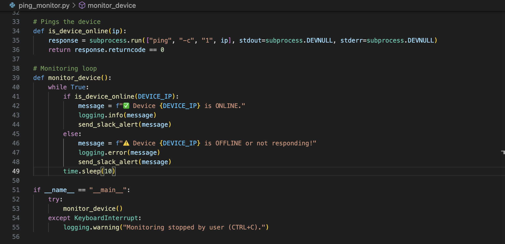

## Project Overview

*can't show github repo link due to the code being on Ai.fish's private repo*

Ai.Fish is developing edge computing solutions that allow AI-powered cameras to run directly on fishing boats. These systems monitor catches in real time, but they face harsh operating conditions like low power, outages, and days-long trips at sea.

To help ensure uptime and reliability, I built a ping monitoring system in Python that automatically checks whether AI devices are online. The system pings each camera or onboard device every 5 minutes and sends instant alerts to a designated Slack channel if any go offline.

This tool helped the team monitor system health without manual checking and provided a foundation for further alerting and logging tools. It runs directly on the low-powered edge devices used during multi-week fishing trips, supporting Ai.Fish's mission of scalable, sustainable marine monitoring.

