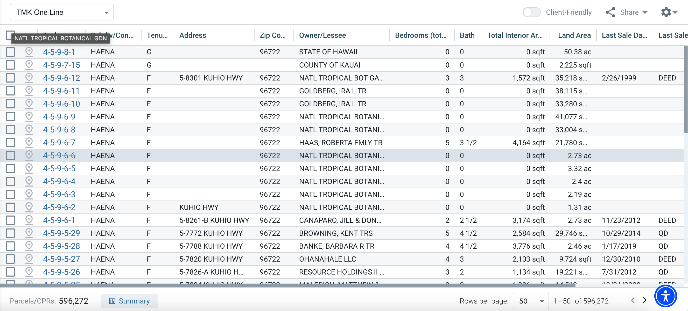
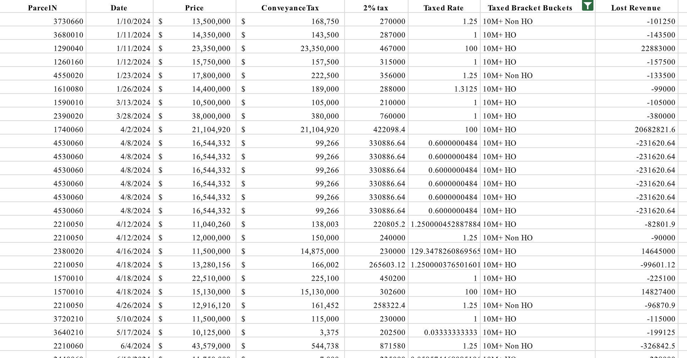

## Project Overview

Github Organization: [Hele-Hale](https://github.com/HHPF-internship/Hele-Hale)

The team at the Hawaiʻi Housing Policy Foundation needed an efficient way to collect and analyze real estate transaction data from the Bureau of Conveyances. The existing manual process of opening PDFs, locating sale information, and recording conveyance tax values was slow and prone to error—especially when dealing with thousands of records.

To solve this, I built Hele-Hale, a custom Python-based web scraper that automates this entire workflow. It takes raw property sale data, extracts key information from linked PDF documents using OCR, and converts Parcel Numbers into proper TMK (Tax Map Key) format. Hele-Hale processed over 100,000 property transactions in a few hours, enabling faster analysis for housing policy decisions across Hawaiʻi.

