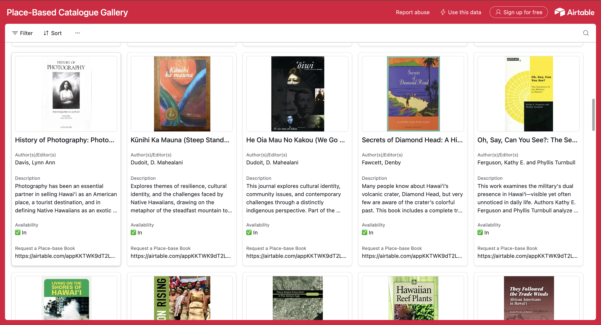
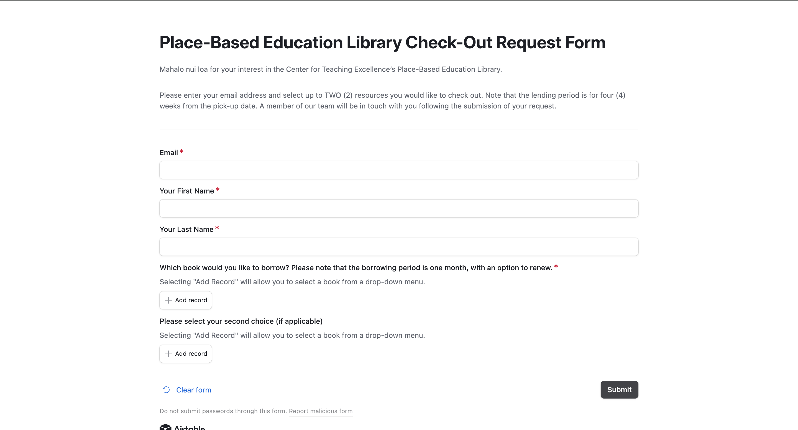

## Project Overview

<a href = "https://www.ofdas.hawaii.edu/resources/placebasedlib/"> OFDAS Place-Based Library </a>

Developed an efficient and user-friendly library checkout system for the Office of Faculty Development and Academic Support at UH Manoa, leveraging Airtable's API to streamline the book borrowing process. The system automates email notifications to alert staff and users when a book request is made, and provides timely reminders for upcoming due dates or overdue returns, ensuring a smooth and organized library experience.

