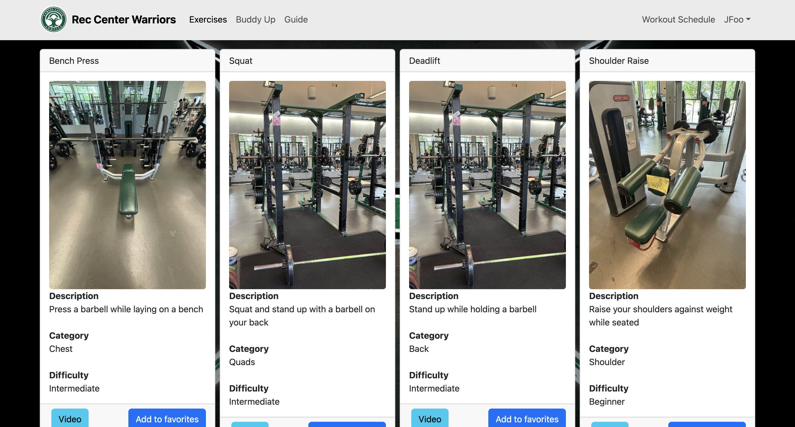

## Project Overview

<a href = "https://www.ofdas.hawaii.edu/resources/placebasedlib/"> OFDAS Place-Based Library </a>

For many people, initiating a fitness journey can be daunting, especially when confronted with the intimidating atmosphere of a gym. Personally, I began my journey with the help of a friend, who assisted me in gradually transitioning to working out independently. Rec Center Warriors provides a platform to connect individuals with potential workout partners, facilitating a smoother entry into the gym experience. Whether one is seeking a companion for workouts or simply aiming to engage with others on their fitness journey, Rec Center Warriors offers a welcoming environment where members can support and motivate each other.

## Project Contributions

I collaborated with my colleagues to develop this website, contributing to various aspects of the project. Among my contributions were enhancing the functionality of the navbar, making the register page, and sourcing the background image. Additionally, I initiated the exercises collection, which was later refined by a friend. I crafted the initial landing page post-login, curated relevant images, and designed on-screen buttons. Moreover, I took responsibility for updating the homepage making sure it met the requirements with M1, M2, and M3.

*more screenshots of pages on this project*

