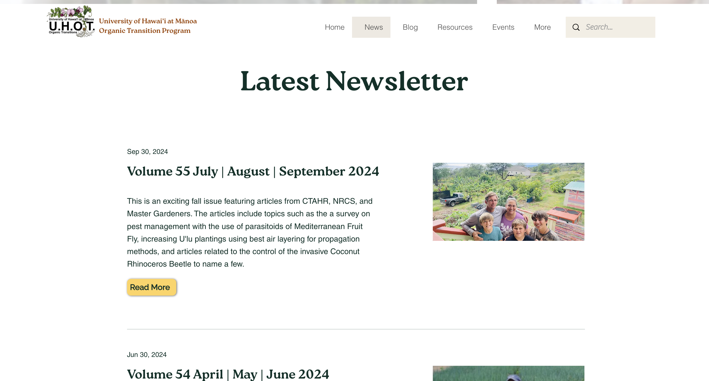

## Project Overview

Website: *still waiting to be published by Sarah*

my rough draft I presented to Sarah initially:  <a href = "https://rural-cs.github.io/"> link<a>

 

## Sarah's Non Profit

When Sarah came to me seeking a website for her nonprofit, I knew how important it was to capture her goals and message clearly. I committed to delivering a professional and impactful site, ensuring her work could be shared with a wider audience. 

 
