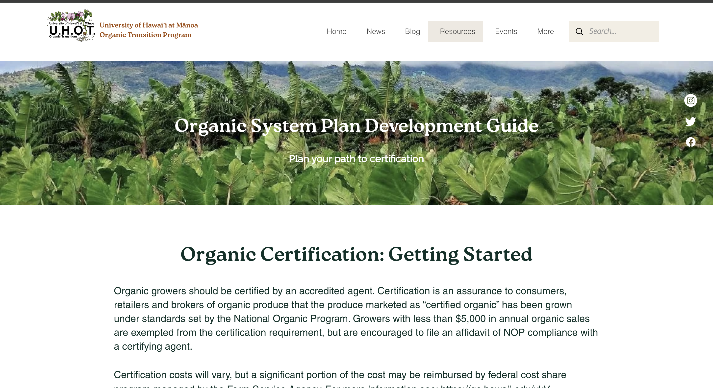
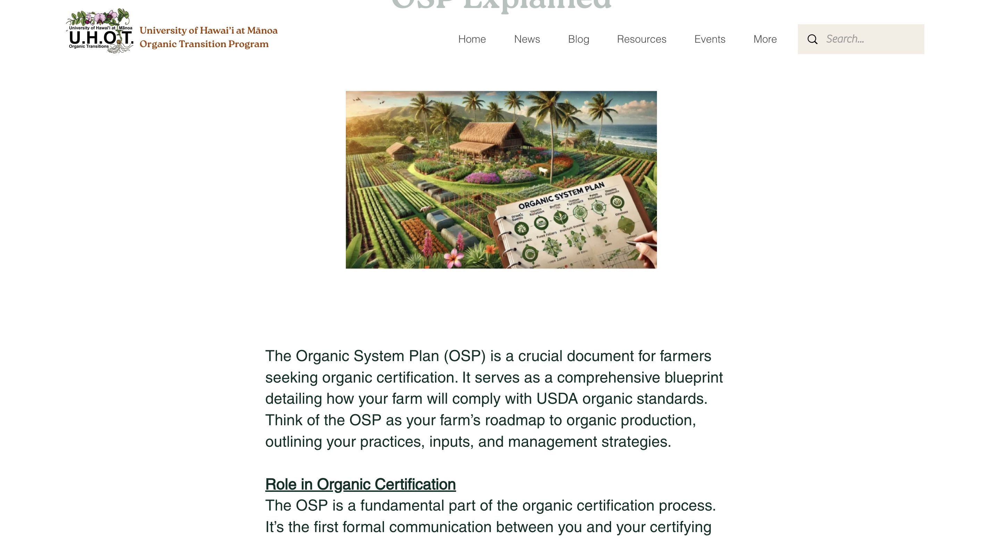

## Project Overview

Website: <a href = "https://www.uhot.org/">UHOT</a>

More details about Sarah's non profit and what she does <a href="https://manoa.hawaii.edu/ctahr/tpss/"> Contact me if you want to support </a>

Site is not published yet but 

 

## Site Details

The University of Hawaiʻi Organic Transition (UHOT) website is designed to guide and support those interested in making a shift towards organic methods. The UHOT site serves as a hub of resources, offering insights into organic techniques, case studies, and research updates, while also providing tools to connect with the broader community. Whether you're seeking guidance on organic methods or looking to engage with others committed to sustainable agriculture, the UHOT website is here to support and inspire a collaborative journey toward a greener future.

 

Throughout my position, I discovered just how much I love the creative side of building a website. Each project, from enhancing visual layouts to optimizing user interactions, gave me the opportunity to think innovatively and explore design choices that could make a meaningful impact on the user experience.

