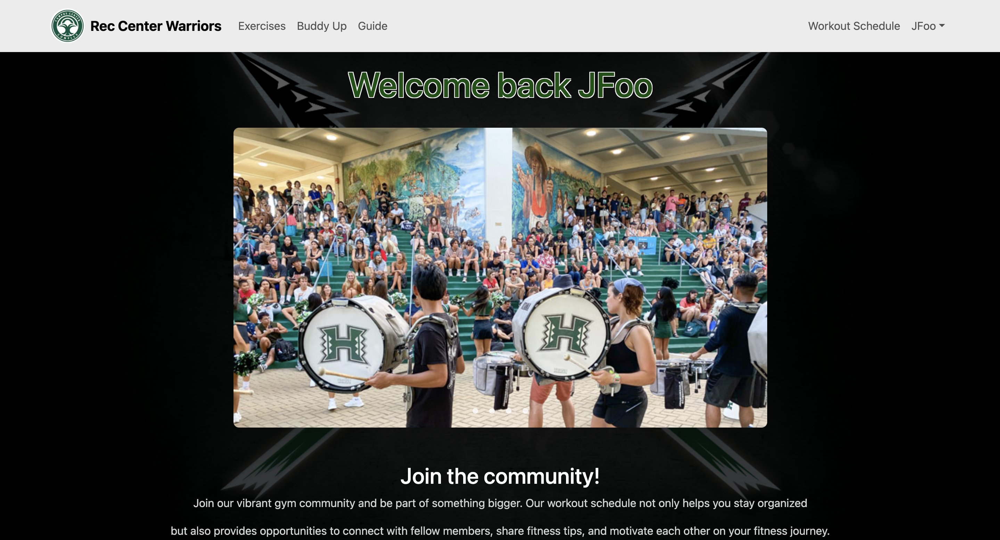

## Overview

Website: <a href="https://rcwarriors.fit">RC WARRIORS</a>

For many people, initiating a fitness journey can be daunting, especially when confronted with the intimidating atmosphere of a gym. Personally, I began my journey with the help of a friend, who assisted me in gradually transitioning to working out independently. Rec Center Warriors provides a platform to connect individuals with potential workout partners, facilitating a smoother entry into the gym experience. Whether one is seeking a companion for workouts or simply aiming to engage with others on their fitness journey, Rec Center Warriors offers a welcoming environment where members can support and motivate each other.

## Contributions

I made this website with the help of my colleagues and a list of the things I helped out with in this project was the functionality of the navbar, the register page's design, finding the background image, I also started off the exercises collection which my friend took over and changed stuff up for it. I also designed the initial landing page after you login and found all those pictures as well as the buttons on the screen, and I was specifically in charge of updating our homepage with updated screenshots, making the Overview, Deployment, Community Feedback etc.

*more screenshots of pages*

