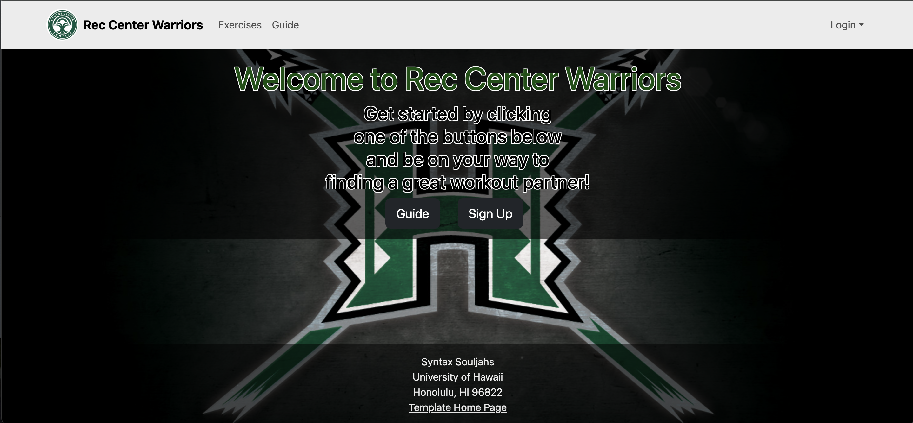

## Project Overview

[Our Github organization](https://github.com/Syntax-Souljahs)

Website: <a href="https://rcwarriors.fit">RC WARRIORS</a>

For many people, initiating a fitness journey can be daunting, especially when confronted with the intimidating atmosphere of a gym. Personally, I began my journey with the help of a friend, who assisted me in gradually transitioning to working out independently. Rec Center Warriors provides a platform to connect individuals with potential workout partners, facilitating a smoother entry into the gym experience. Whether one is seeking a companion for workouts or simply aiming to engage with others on their fitness journey, Rec Center Warriors offers a welcoming environment where members can support and motivate each other.

Our landing page:

## Project Contributions

I collaborated with my colleagues to develop this website, contributing to various aspects of the project. Among my contributions were enhancing the functionality of the navbar, making the register page, and sourcing the background image. Additionally, I initiated the exercises collection, which was later refined by a friend. I crafted the initial landing page post-login, curated relevant images, and designed on-screen buttons. Moreover, I took responsibility for updating the homepage making sure it met the requirements with M1, M2, and M3.

Our login landing page:

## What I learned from this experience

Throughout this project, I gained invaluable insights into effective teamwork and website development. Initially, I struggled with navigating the main source code and often found myself inadvertently causing issues. However, with the guidance of my team member, I learned how to navigate and modify the project code without risking the integrity of our final website. This experience highlighted the significance of clear communication within a team, especially when dealing with unexpected merge conflicts. Witnessing the seamless alignment of our efforts brought a sense of triumph and reinforced the importance of collaboration. Overall, this project provided me with a glimpse into the software engineering industry, fostering not only technical skills but also lasting connections with my team members, whom I hope to stay in touch with as we progress in our careers.

*more screenshots of pages on this project*

