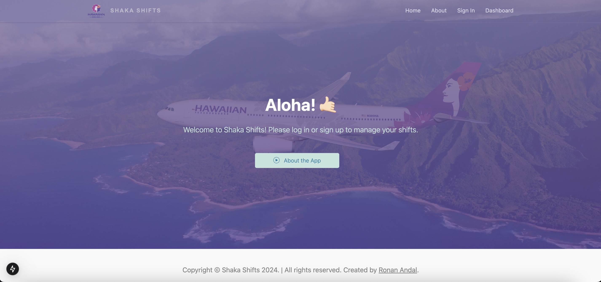

## Project Overview

Github Organization: [Shaka-Shifts](https://github.com/ShakaShifts/ShakaShifts.github.io)

More details about the site : <a href="https://syntax-souljahs.github.io/"> Shaka Shifts </a>

Managing work schedules can often be a challenge, especially when coordinating shift swaps, tracking availability, and ensuring seamless communication among team members. Inspired by workplace scheduling apps at Hawaiian Airlines and Target, Shaka Shifts provides a streamlined platform for employees to manage their schedules with ease. The app enables users to create and view schedules, put shifts up for grabs, and set their availability, fostering a collaborative and efficient work environment. Whether you're swapping shifts, checking your upcoming schedule, or managing time-off requests, Shaka Shifts ensures that workplace scheduling is simple, transparent, and accessible.

*more screenshots of pages on this project*

