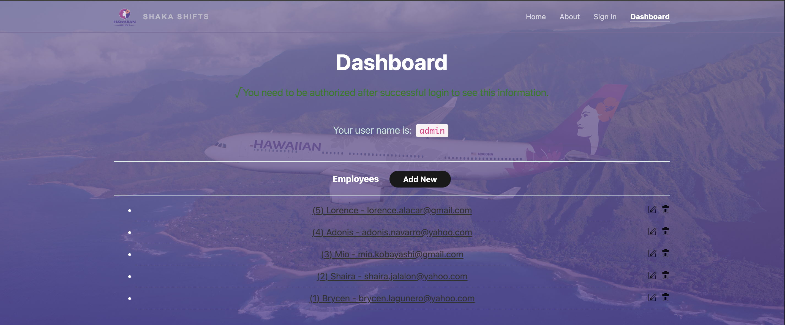

## Project Overview

Github Organization: [Shaka-Shifts](https://github.com/team-tres/team-tres-app)

*STILL IN PROGRESS*

Managing work schedules can often be a challenge, especially when coordinating shift swaps, tracking availability, and ensuring seamless communication among team members. Inspired by workplace scheduling apps at Hawaiian Airlines and Target, Shaka Shifts provides a streamlined platform for employees to manage their schedules with ease. The app enables users to create and view schedules, put shifts up for grabs, and set their availability, fostering a collaborative and efficient work environment. Whether you're swapping shifts, checking your upcoming schedule, or managing time-off requests, Shaka Shifts ensures that workplace scheduling is simple, transparent, and accessible.

With Shaka Shifts, users can:

- Create and view schedules for employees
- Manage time-off requests seamlessly

The platform aims to foster a collaborative and efficient work environment by ensuring that scheduling is simple, transparent, and accessible for everyone. Whether you're swapping shifts, reviewing your upcoming schedule, or managing team availability, Shaka Shifts makes it easy.

Current features:
- Preloaded default employees in the roster with customizable attributes (e.g., date hired, ID, etc.)
- A working admin sign-in page
- Can create new employees with departments, age, ID# etc.

Planned features:
- Set and communicate availability
- Offer shifts for others to take

*more screenshots of pages on this project*

