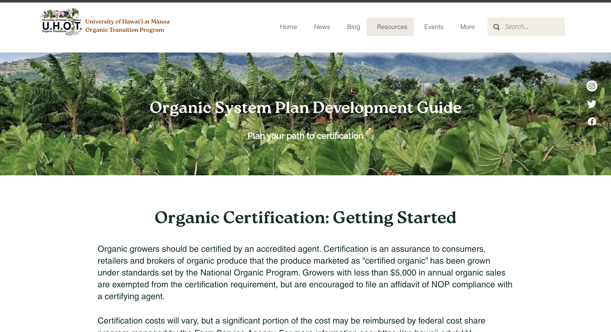
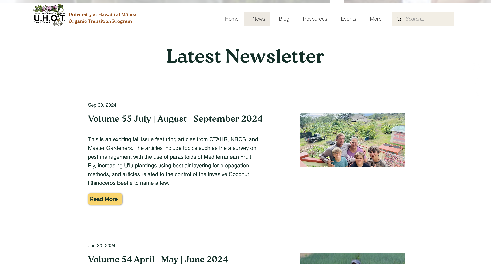
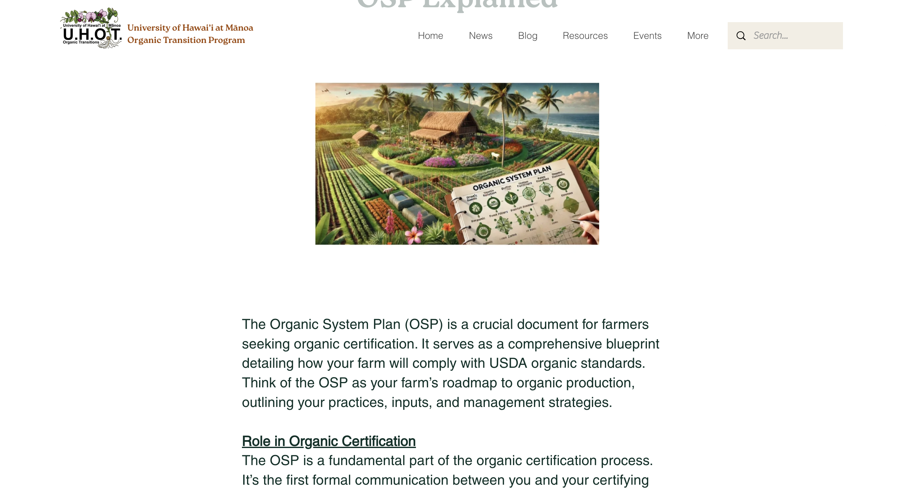

## Project Overview

Website: <a href = "https://www.uhot.org/">UHOT</a>

More details about my job and what they do : <a href="https://manoa.hawaii.edu/ctahr/tpss/"> Department of Tropical Plants and Soil Sciences </a>

A significant aspect of my role centered around managing and enhancing the UHOT website, where I utilized my skills in Wix, JavaScript, and HTML to develop a more engaging, interactive platform. Beyond routine updates, I integrated dynamic content elements to keep the website relevant with the latest research, findings, and events in organic farming. By implementing custom HTML and JavaScript, I was able to fine-tune the design and interactivity, allowing for a more user-friendly navigation and a visually appealing layout that effectively conveys the project's mission. Leveraging Wix’s design tools, I optimized visual components, updated layouts, and streamlined navigation, aiming to make the website a valuable, accessible resource for seasoned organic farmers and newcomers to sustainable agriculture alike. Through these efforts, I transformed the UHOT website into a dynamic, informative hub that aligns with the evolving needs of its audience.

## Site Details

The University of Hawaiʻi Organic Transition (UHOT) website is designed to guide and support those interested in making a shift towards organic methods. The UHOT site serves as a hub of resources, offering insights into organic techniques, case studies, and research updates, while also providing tools to connect with the broader community. Whether you're seeking guidance on organic methods or looking to engage with others committed to sustainable agriculture, the UHOT website is here to support and inspire a collaborative journey toward a greener future.

Throughout my position, I discovered just how much I love the creative side of building a website. Each project, from enhancing visual layouts to optimizing user interactions, gave me the opportunity to think innovatively and explore design choices that could make a meaningful impact on the user experience.

*more screenshots of pages on this project*

