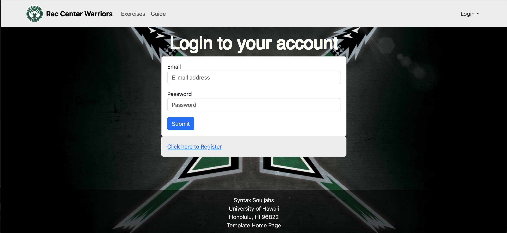

## Project Overview

Website: <a href = "https://www.uhot.org/">UHOT</a>

More details about my job and what they do : <a href="https://manoa.hawaii.edu/ctahr/tpss/"> Department of Tropical Plants and Soil Sciences </a>

a significant aspect of my role centered around managing and enhancing the UHOT website. Beyond routine updates, I was responsible for making the website an engaging, up-to-date platform that reflects the latest developments, research, and events in organic farming. This involved not only keeping content relevant by incorporating new findings and community activities but also focusing on the site’s overall design to improve user experience. By optimizing visuals, updating layouts, and enhancing navigation, I aimed to create a more user-friendly environment that effectively communicates the project’s mission. Through these efforts, I worked to ensure the website remains an accessible, dynamic resource for both seasoned organic farmers and those new to sustainable agriculture practices.

## Site Details

The University of Hawaiʻi Organic Transition (UHOT) website is designed to guide and support those interested in making a shift towards organic methods. The UHOT site serves as a hub of resources, offering insights into organic techniques, case studies, and research updates, while also providing tools to connect with the broader community. Whether you're seeking guidance on organic methods or looking to engage with others committed to sustainable agriculture, the UHOT website is here to support and inspire a collaborative journey toward a greener future.

Throughout my position it showed me how much I love the creative side of creating a website, and when given the chance to

*more screenshots of pages on this project*

